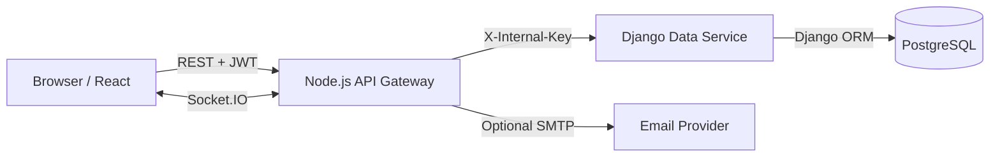

# HomeServe — Home-services marketplace and operations platform

HomeServe is a production-style full-stack booking system for customers, service providers and platform administrators. The interface is inspired by the clarity and service-first nature of established home-service marketplaces, while using an original visual system and a more operational dashboard experience.

## What is included

- Responsive React + Vite marketplace and dashboards.
- Customer discovery, filters, sorting and a two-step booking drawer.
- Customer appointment history, server-backed booking, eligible cancellation and recommendations.
- Provider-owned request queue, enforced status transitions and service publishing.
- Admin-only marketplace analytics, operational cancellation and CSV export.
- Seeded customer, provider and admin accounts that authenticate through the real API.
- Express API gateway with JWT, bcrypt, role authorization, rate limits and Socket.IO.
- Django REST Framework data service with Django ORM and PostgreSQL.
- Collision-safe provider slots, immutable booking ownership and role-specific transition policies.
- Docker Compose, service health checks, seeded accounts and documentation.

## Architecture



The Node.js gateway owns the public contract, authentication, authorization and real-time communication. Django remains private and owns relational persistence and business data access.

## Docker health checks

The Django data-service exposes a lightweight `/health/` endpoint implemented with plain Django rather than Django REST Framework. This keeps orchestration health checks independent from authentication, database queries, and DRF renderer setup. The private `/internal/` API remains protected by `X-Internal-Key`.

## Run with Docker

```bash
cp .env.example .env
# Replace every development secret in .env
docker compose up --build
```

Open `http://localhost:4000`.

If you previously built an older data-service image, rebuild it once without cache:

```bash
docker compose build --no-cache data-service
docker compose up --build
```

If Gunicorn starts but Compose still marks the data service unhealthy, the included
health check uses a direct `127.0.0.1` probe and a startup grace period. Recreate
the stack so the updated health-check definition is applied:

```bash
docker compose down
docker compose up --build -d
docker compose ps
```

### Demo accounts

All seeded accounts use `Password123!`.

| Role | Email |
|---|---|
| Admin | `admin@homeserve.local` |
| Provider | `provider@homeserve.local` |
| Customer | `customer@homeserve.local` |

The three demo buttons perform real API logins using the seeded credentials. There is no client-side role switch or unauthenticated dashboard access.


## Authorization model

- **Customer:** browse services, create bookings for their own account, view only their appointments, cancel only `pending` or `confirmed` visits, and confirm completion only after the provider requests checkout.
- **Provider:** view only appointments assigned to their provider ID, publish services owned by that ID, and progress jobs through `pending → confirmed → in_progress → completion_requested`; the customer then confirms `completed`.
- **Admin:** view platform-wide appointments and analytics, export reports, and cancel eligible visits for operational intervention. Admins cannot mark technician work complete.
- Status changes are emitted to both customer and provider Socket.IO rooms so each dashboard stays synchronized.

The React application hides unauthorized routes, but the Express gateway is the enforcement boundary. Every protected request reloads the active account and current role from PostgreSQL before authorization, so a disabled account or changed role takes effect immediately. Provider IDs, customer IDs, prices and appointment ownership are derived or verified server-side.

## Local development

### Django data service

```bash
cd services/data-service
python -m venv .venv
source .venv/bin/activate
pip install -r requirements.txt
export USE_SQLITE=true
export INTERNAL_SERVICE_KEY=development-internal-key-change-me
python manage.py migrate
python manage.py seed_demo
python manage.py runserver 8000
```

For PostgreSQL, omit `USE_SQLITE` and set the `POSTGRES_*` environment variables.

### Node gateway

```bash
cd services/gateway
npm install
export DATA_SERVICE_URL=http://localhost:8000
export INTERNAL_SERVICE_KEY=development-internal-key-change-me
export JWT_SECRET=development-jwt-secret-change-me-123456
npm run dev
```

### React application

```bash
cd apps/web
npm install
npm run dev
```

Vite proxies `/api` and Socket.IO traffic to `http://localhost:4000`.

## Tests

```bash
cd services/data-service
USE_SQLITE=true python manage.py test

cd ../gateway
npm test
```

## Repository structure

```text
apps/web/                 React marketplace and role dashboards
services/gateway/         Public Express API, auth and Socket.IO
services/data-service/    Private Django ORM data service
docs/                     Product, API, model and deployment docs
docker-compose.yml        PostgreSQL and application orchestration
```

## Documentation

- [Project proposal](docs/PROPOSAL.md)
- [REST API](docs/API.md)
- [Data model](docs/DATA_MODEL.md)
- [UI system](docs/UI_SYSTEM.md)
- [Deployment](docs/DEPLOYMENT.md)
