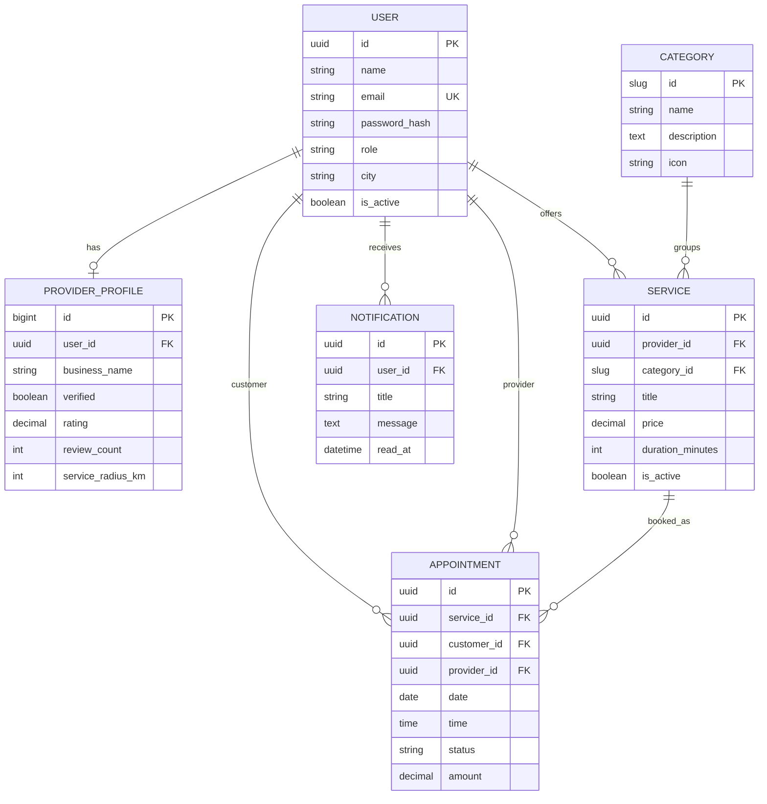

# Data model

## Integrity rules

- User email is unique.
- A service belongs to one provider and one category.
- The selected provider must own the booked service.
- A provider cannot hold two non-cancelled appointments at the same date and time.
- Appointment amount is copied from the service when a booking is created.
- Terminal appointment states cannot be reopened through the public gateway.
